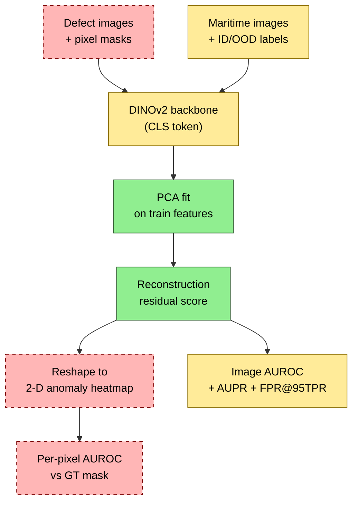

# Semantic OOD Detection on Maritime Vessel Dataset — Method

Applies SubspaceAD (DINOv2 + PCA reconstruction residual) to image-level OOD detection: 17 in-dist ship classes vs 4 OOD ship classes. The original `main.py` is untouched — all OOD logic lives in new files.

> **This document is method-only.** All quantitative results (clean baselines, ablations, threshold/balanced analysis, degradation robustness, continual backbone, fusion) are in **`REPORT.md`**. Run commands are in **`../COMMAND.md`**.

## Adaptation Summary

| | Original SubspaceAD | This adaptation |
|---|---|---|
| Task | Pixel-level defect detection | Image-level OOD classification |
| Labels | Pixel masks | Binary (0=ID, 1=OOD) |
| Metric | Per-pixel AUROC | Image AUROC / AUPR / FPR@95TPR |
| Backbone | HuggingFace DINOv2 | DINOv2 Maritime-SSL ViT-L/16 — **Base** (RGB+IR) & **Continual** (degraded-IR) checkpoints |
| Token type | Patch tokens (spatial) | **CLS** token (image-level, no spatial reshape) |

## How the Pipeline Was Modified

The DINOv2 + PCA + reconstruction-residual core is **kept identical**. Changes are at the input boundary (binary ID/OOD labels in place of pixel masks) and the output boundary (skip the 2-D heatmap reshape; report image-level metrics).



🟢 included · 🟡 modified · 🔴 excluded

| Stage | Status | Detail |
|---|---|---|
| Dataset enumeration | 🟡 Modified | NEW `data/maritime.py` — yields `(paths, binary labels)`; no GT masks |
| DINOv2 backbone | 🟡 Modified | NEW `core/extractor_local.py` loads Meta-format teacher checkpoints |
| Token selection | 🟡 Modified | `extract_features.py` uses `get_intermediate_layers(..., return_class_token=True)`, stacking the CLS vector of every layer; patch tokens not materialized |
| PCA fit | 🟢 Included | `PCAModel` from `core/pca.py` — two-pass streaming mean+cov, `eigh`, EV-based `k` |
| Reconstruction residual | 🟢 Included | `calculate_anomaly_scores()` from `post_process/scoring.py`, reused unchanged |
| Spatial heatmap reshape | 🔴 Excluded | No spatial dim with CLS; no GT mask |
| Per-image score aggregation | 🔴 Excluded | CLS scoring returns one scalar per image directly |
| Pixel-level AUROC | 🔴 Excluded | No pixel ground truth |
| Image AUROC + AUPR + FPR@95TPR | 🟡 Modified | Same `sklearn.metrics`; labels are binary ID (0) / OOD (1) |

## Pipeline (two stages, cached)

```
extract_features.py   →  one .npz cache per (dataset, backbone)
                         all 24 CLS layers × all fit/val/test images
                         + precomputed subset_idx_{100..10000}

anomaly_detection.py  →  PCA grid on a cache; one metrics.json per config
                         axes: layers × agg × EV × score × drop_k
                         (--eval_cache_file lets fit & eval come from different caches)

aggregate_results.py  →  val-best selection per experiment, ablation slices, CSV
```

Two-stage split exists because DINOv2 forwards (~45 min/dataset) dominate cost. A grid (1920 configs/size) reuses cached features in minutes. Caches live in `/data/hanchong/subspacead_cache/`.

## Hyperparameter axes (paper-only)

The grid sweeps exactly the axes the reference SubspaceAD exposes — nothing invented. Selection is on **val AUROC**; test is reported on the val-selected config.

| Axis | Values |
|---|---|
| `layers` | L1, L2, L4, L6, L8, L12, L18, Lmid (`[-12..-18]`, paper default) |
| `agg_method` | mean, concat |
| `pca_ev` | 0.5, 0.7, 0.9, 0.95, 0.99, 0.999 |
| `score_method` | reconstruction, mahalanobis, cosine, euclidean |
| `drop_k` | 0, 5, 20, 50, 100 |

= **1920 configs/size**. Concat configs are auto-skipped when `N_fit < D` (rank-deficient PCA).

## New Files

| File | Purpose |
|---|---|
| `scripts/maritime/extract_features.py` | Incremental DINOv2 CLS extraction → one cache `.npz` |
| `scripts/maritime/dump_chain.sh` | Generic extraction driver: one cache per call, any checkpoint/dataset (env-parameterized) |
| `scripts/maritime/fuse_pool_features.py` | Pool two caches along the sample axis (RGB∪IR) |
| `scripts/maritime/anomaly_detection.py` | Paper-axis PCA grid; `--eval_cache_file` for cross-domain |
| `scripts/maritime/aggregate_results.py` | Val-best + per-axis ablations + summary CSV |
| `scripts/maritime/eval_balanced.py` | Class-balanced test metrics (multi-seed) |
| `scripts/maritime/run_all.sh` | Single orchestrator: builds all caches + runs all 8 experiments across 4 GPUs + aggregates |
| `src/subspacead/data/maritime.py` | Path enumeration, ID/OOD labels |
| `src/subspacead/core/extractor_local.py` | Loads Meta DINOv2 teacher checkpoints |

## Local DINOv2 Loading

`extractor_local.py` delegates **all architecture parsing to DINOv2's own config system** — same flow as `dinov2.eval.linear`:

```
OmegaConf.merge(default_config, config_file, opts)
  → build_model_from_cfg(cfg, only_teacher=True)
  → load_pretrained_weights(model, pretrained_weights, "teacher")
```

Both backbones — **Base** (SSL on RGB+IR) and **Continual** (initialized from Base, continued SSL on degraded IR) — share architecture (`vit_large`, patch 16, `block_chunks=4`, `num_register_tokens=4`) and normalization `(0.5, 0.5, 0.5)`, so only `--pretrained_weights` changes between them.
